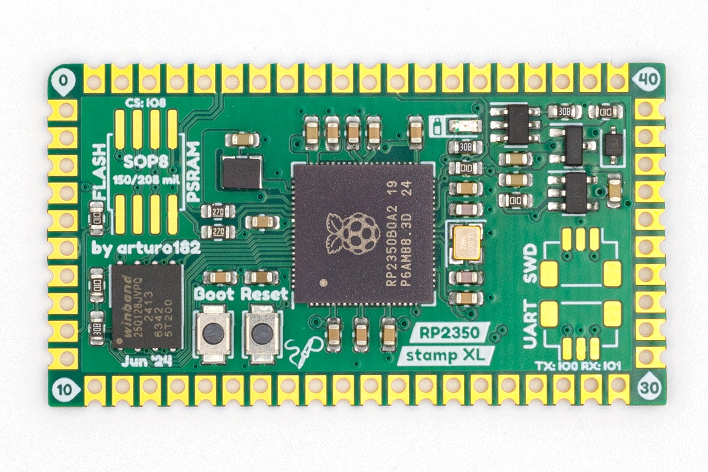

# The RP2350 Stamp XL

The Stamp was created to allow you to use the **Raspberry Pi RP2350B** in your designs without having to solder small-pitch QFN chips or worry about lots of external circuitry.

The RP2350 Stamp XL is partially pad-compatible with the smaller Stamps. The left-side pads as well as half of the top and bottom ones are exactly the same.

All you need to get you started is a 5V supply or a LiPo battery. The Stamp will take care of the charging and switching the power sources.

The castellated edges with **2mm pitch** can be hand-soldered directly to a Carrier board, used with pin headers for more flexibility, or connected without soldering using [FlexyPins](https://docs.solder.party/flexypin), which are spring connectors designed for modules with castellated edges. You can find footprints for many PCB programs [here](https://github.com/solderparty/rp2xxx_stamp_footprints).

We were also able to squeeze in two new functional pads: an LDO EN pad, connected to the LDOs EN signal, and a BAT STAT, connected to the LiPo charger's STAT pin.

At only **1 by 1¾ inch**, the Stamp XL packs a lot of features:
* **16MB of FLASH**
* **500mA 3.3V LDO**
* **All 48 GPIOs broken out**
* **A footprint for a second QSPI FLASH/PSRAM**
* Footprints for SWD and UART JST connectors, pin-compatible with the Raspberry Pi Debug Probe
* LiPo supply and charging circuit (with charging LED)
* USB broken out
* SWD broken out
* Reset Button
* Bootsel Button
* 12MHz crystal

and of course, everything that comes with the Raspberry Pi RP2350 itself:
* Dual core ARM Cortex-M33 or Hazard3 @ 150MHz
* 520kB SRAM
* 2 UARTs
* 2 SPIs
* 2 I2Cs
* 24 PWM channels
* 12 PIO state machines
* 1 HSTX peripheral
* USB with Host and Device support

The RP2350 comes with a pre-programmed ROM UF2 Bootloader, by pulling the BOOTSEL pin low and resetting, or by double-pressing the RESET button (if the FW supports it), you can upload new firmware using the USB disk drive.

In addition to the Stamps we also offer a few reference designs, see the Carriers in the [Stamp-related category](https://docs.solder.party/rp2xxx-stamp-related) as well as our [Flux projects](https://docs.solder.party/flux).

The CircuitPython firmware for the Stamp comes with a built-in board files for the Carriers, for example you can access the RP2040 Stamp Carrier pins and interfaces by using `import stamp_carrier_board as board`. See [here](https://github.com/adafruit/circuitpython/tree/main/ports/raspberrypi/boards/solderparty_rp2040_stamp) for all the available Carrier board files.

# Links

For more information visit https://rp2350-stamp-xl.solder.party/

